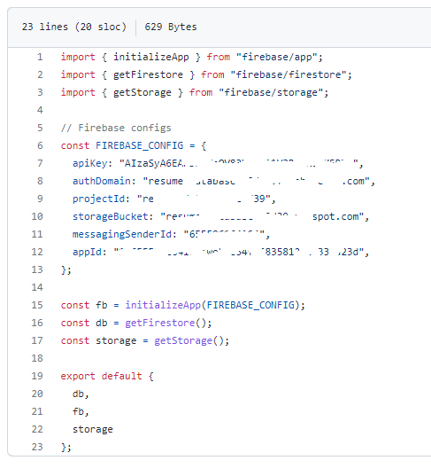
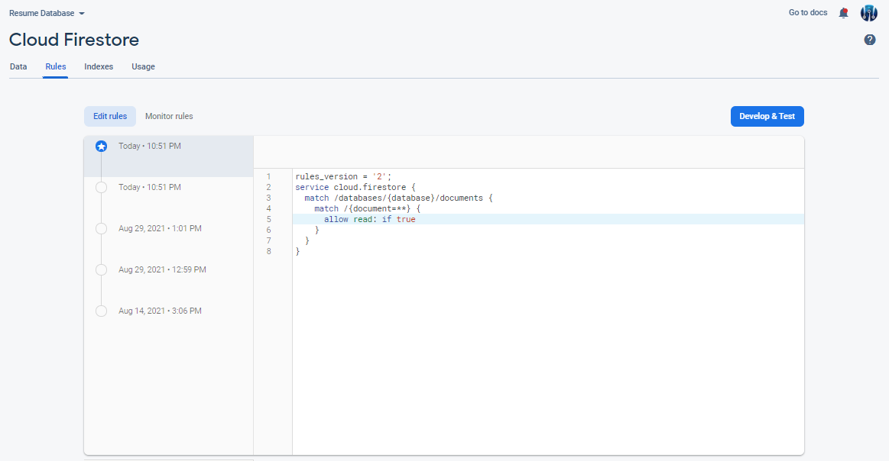

[](https://sonarcloud.io/dashboard?id=WGLabz_resume)  [](https://sonarcloud.io/dashboard?id=WGLabz_resume)  [](https://sonarcloud.io/dashboard?id=WGLabz_resume)
[](https://sonarcloud.io/dashboard?id=WGLabz_resume)

# Resume with Vue/Vuetify and Firebase

```
npm install
npm run serve
npm run build
npm run lint
```
## Setting it up!!
* Fork this repository.
* Create a repository where you want to host your static files. If you want to access your website using url like `<username>.github.io` like mine [bikashnpanda.github.io](https://bikashnpanda.github.io), create the repository on same name.
* Create `firebase` project and obtain config file. [Click Here]()
* Now go to `/src/firebase/index.js` section in the cloned repo. Replace the `const FIREBASE_CONFIG = {}` section with the config obtained in the previous step.

* 
## Allow READ access only, firestore

Goto `Firestore Database` -> `Rules` And add the following lines,

```js

rules_version = '2';
service cloud.firestore {
  match /databases/{database}/documents {
    match /{document=**} {
      allow read: if true
    }
  }
}
```


## Import/Export Firebase Data

* Install [node-firestore-import-export](https://www.npmjs.com/package/node-firestore-import-export) globally by using the command `npm install -g node-firestore-import-export`
* Create a new private key from firebase project.
    
    * Goto  `Project Settings` -> `Service Accounts` in firebase console.
    * Click on `Generate new private key`. Save the file and note down the file location and name.

* To export existing databases from Firebase, replace the filename and the path in the following command and run in the terminal.

```js
firestore-export --accountCredentials <location>/<filename> --backupFile data.json

e.g. firestore-export --accountCredentials fb-key.json --backupFile data.json
```
* To import JSON file to the firebase DB use the following command. Please ensure the JSON file is valid.

```js
firestore-import --accountCredentials path/to/credentials/file.json --backupFile /backups/data.json

e.g. firestore-import --accountCredentials fb-key.json --backupFile data.json

```

You can download the sample JSON file from [here](data.json)


